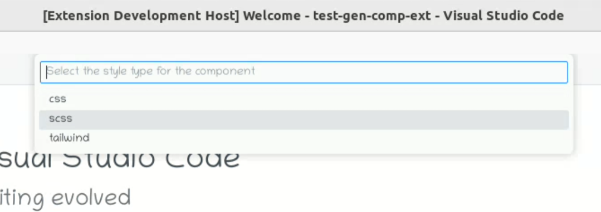

# React Component Files Generator

## Overview

The React Component Files Generator is a Visual Studio Code extension that streamlines the process of creating the basic file structure for React components in your workspace.

## Preview

## Features

- Quickly generate the file structure for React components.
- Simplify the creation of component files, including JavaScript/TypeScript, CSS, and SCSS stylesheets.

## Commands

- **Generate Component Files:** Open the command palette and run "Generate Component Files" to create the basic file structure for a React component.

## Usage

1. Open Visual Studio Code.
2. Open the desired workspace folder.
3. Open the command palette (`Ctrl+Shift+P` or `Cmd+Shift+P` on macOS) or `Right-click` on a folder in the Explorer.
4. Run "Generate Component Files."
5. Follow the prompts to specify the components path, folder name, component name, component extension and stylesheet type.

#### Component Path:

#### Folder Name:

#### Component Name:

#### Component Extension:

#### Stylesheet Type:

 
 

6. Once you've selected the `component extension` and `stylesheet type`, preferences will be saved for this workspace. You won't have to select them again for future component creations in this workspace.

7. Alternatively, use the shortcut keys (`Ctrl+Alt+C` or `Cmd+Alt+C` on macOS)

**Note:** If no `component extension` is selected, the `component extension` will be set to `.js`. If no `stylesheet type` is selected, the default `stylesheet type` will be set to `.css`.

## Examples

1. Suppose you run the "Generate Component Files" command and provide the following inputs:

- Components Path: `src/components`
- Folder Name: `button`
- Component Name: `MyButton`
- Component Extension: `tsx`
- Stylesheet Type: `scss`

The extension will create the following files:

- `src/components/button/MyButton.tsx`
- `src/components/button/MyButton.module.scss`
- `src/components/button/index.tsx`

2. Suppose you run the "Generate Component Files" command and provide the following inputs:

- Components Path: `src/components`
- Folder Name: `header`
- Component Name: `Header`
- Component Extension: `jsx`
- Stylesheet Type: `css`

The extension will create the following files:

- `src/components/header/Header.jsx`
- `src/components/header/Header.css`
- `src/components/header/index.jsx`

3. Suppose you run the "Generate Component Files" command and provide the following inputs:

- Components Path: `''`
- Folder Name: `my-component`
- Component Name: `MyComponent`
- Component Extension: `tsx`
- Stylesheet Type: `tailwind`

The extension will create the following files:

- `my-compnent/MyComponent.tsx`
- `my-compnent/index.tsx`

## Requirements

- Visual Studio Code version 1.60.0 or higher.

## Installation

1. Open Visual Studio Code.
2. Go to the Extensions view (`Ctrl+Shift+X` or `Cmd+Shift+X` on macOS).
3. Search for "React Component Files Generator."
4. Click Install.

## Release Notes

### 1.0.0

Initial release of the React Component Files Generator.

## Known Issues

No known issues.

## Contributing

Contributions are welcome! Please submit issues and pull requests on the [GitHub repository](https://github.com/ranathedev/react-component-files-generator).

## License

This extension is licensed under the [MIT License](https://github.com/ranathedev/react-component-files-generator/blob/main/LICENSE).
